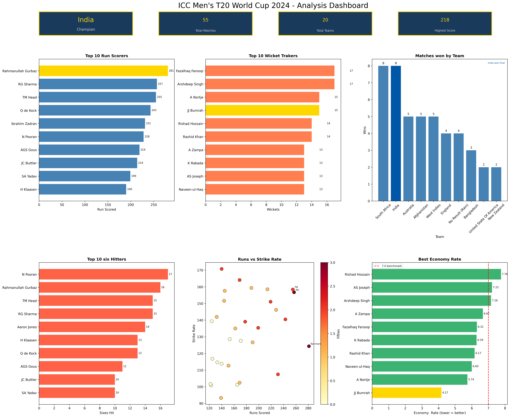
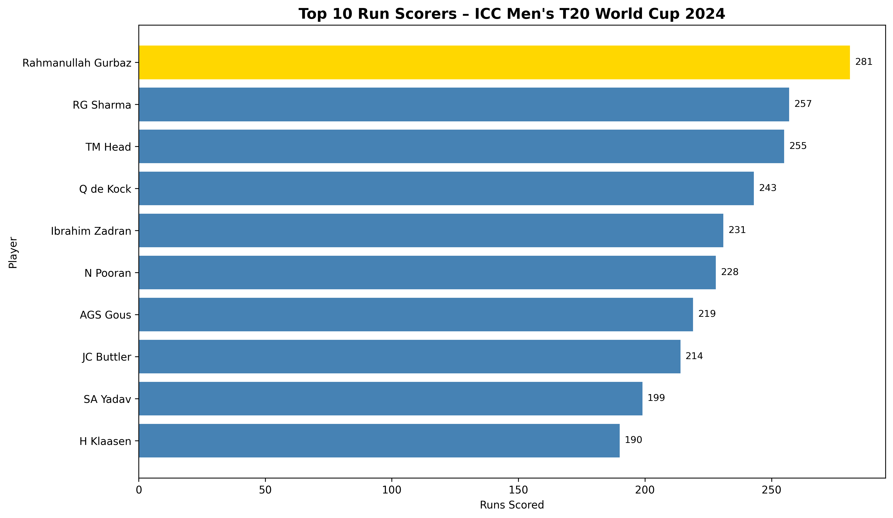
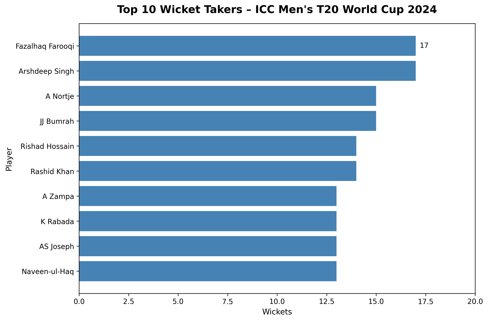
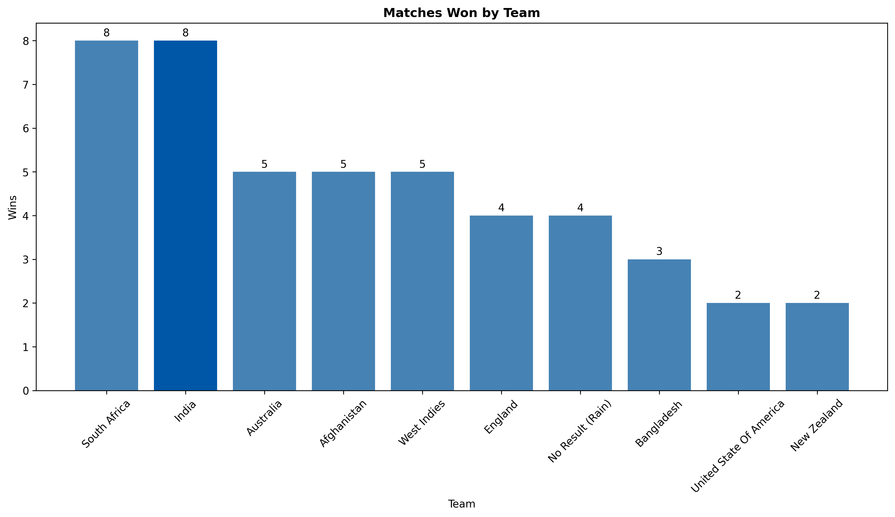
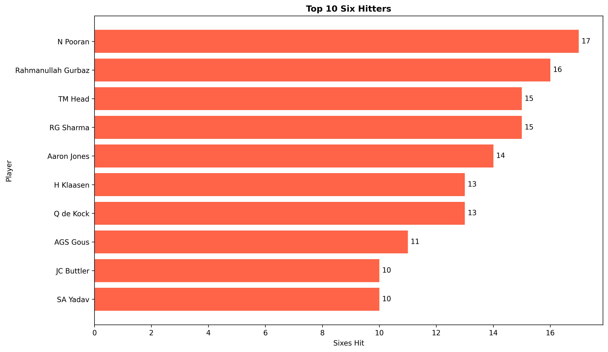
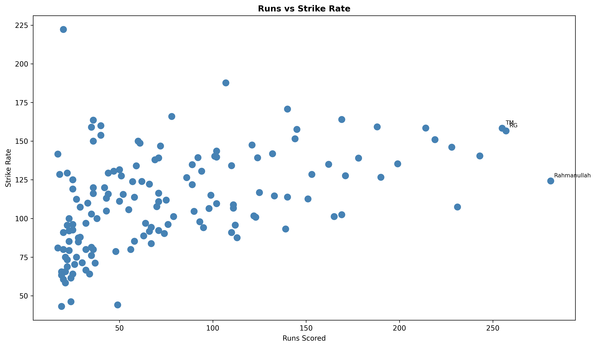
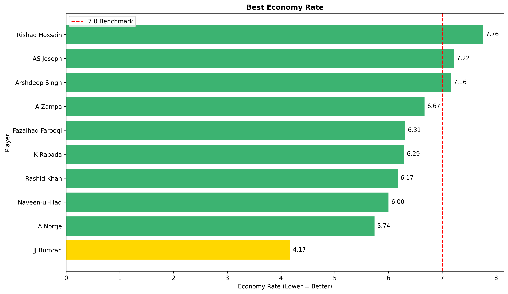

# 🏏 ICC Men's T20 World Cup 2024 Analysis Dashboard 🏆

## 📌 Project Overview

This project presents an exploratory data analysis and visualization of the **ICC Men's T20 World Cup 2024** using Python.

The project analyzes team performance, batting statistics, bowling statistics, and important tournament insights through an interactive-style dashboard created with **Matplotlib**.

---

## 📊 Dashboard Preview

---

## 📈 Analysis Includes

- 🏏 Top 10 Run Scorers
- 🎯 Top 10 Wicket Takers
- 🏆 Matches Won by Each Team
- 💥 Top 10 Six Hitters
- 📊 Runs vs Strike Rate
- ⚡ Best Bowling Economy Rates

---

## 🔍 Key Insights

- 🇮🇳 **India won the ICC Men's T20 World Cup 2024.**
- 🏏 **Rahmanullah Gurbaz** was the tournament's leading run scorer with **281 runs**.
- 🎯 **Fazalhaq Farooqi** and **Arshdeep Singh** took **17 wickets each**.
- ⚡ The dashboard compares batting and bowling performances.
- 📊 Team performance is analyzed using match results and player statistics.

---

🛠️Technologies Used

Python
Pandas
NumPy
Matplotlib
Google Colab
GitHub

## 📊 Visualizations

### 1. Top 10 Run Scorers

**Compared the leading run scorers of the tournament.**

---

### 2. Top 10 Wicket Takers

**Visualized the players who took the highest number of wickets.**

---

### 3. Matches Won by Each Team

**Compared the number of matches won by each team during the tournament.**

---

### 4. Top 10 Six Hitters

**Identified the players who hit the most sixes.**

---

### 5. Runs vs Strike Rate

**Compared players' total runs with their batting strike rates.**

---

### 6. Best Bowling Economy Rates

**Analyzed the bowlers with the best economy rates.**

